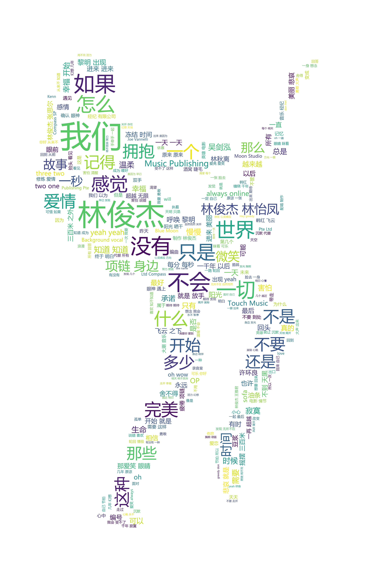
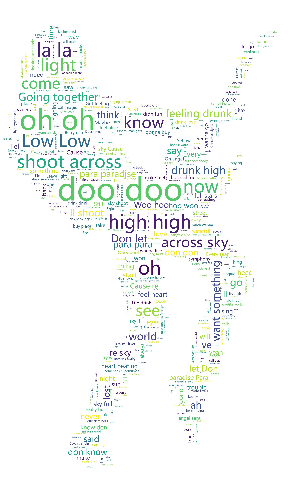
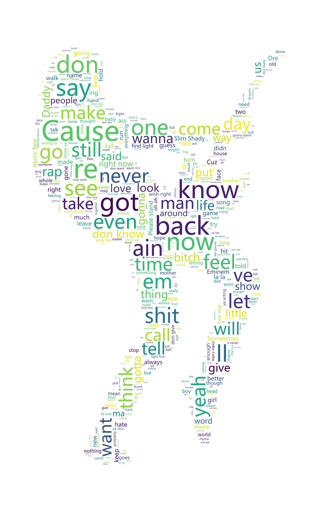

### 看看那些歌手都唱了什么：爬取网易云歌曲

运行过程：
```
爬某一首歌：
先利用浏览器浏览网易云的某一首歌，获得该歌的id，填入oneSong.py：lrc_url处
cmd输入：python oneSong.py
然后运行generate.py（修改打开文件为one_lrc.txt）

爬取某歌手top50歌曲：
利用浏览器获得歌手ID，填入topSong.py:singer_url处

目前不需要cookie，如果后续需要网易云采取了反爬措施，可能就需要cookie了
cookie获取，利用爬虫工具（推荐fiddler4），获得如：https://music.163.com/artist?id=32665这条 链接的cookie，填入header的cookie处


```

```
条件：
python3
jieba、wordcloud、request等模块
```
将本项目克隆到本地即可运行。

效果：

可以看到出现较多人名，所以需要去除（参考oneSong.py）


酷玩的音乐真的老少皆宜，doo doo doo , oh oh oh , la la la, Low low low .... 不识英文大字的我也可以愉快的听歌


还算比较文明

最关键的词语是：人生、自己、生活，大部分朋友的签名都是关乎自己的生活，努力活着:)


  [1]: https://github.com/CriseLYJ/awesome-python-login-model/blob/master/webWeixin/webWeixin.py
  [2]: https://www.zhihu.com/question/28975391/answer/100796070
