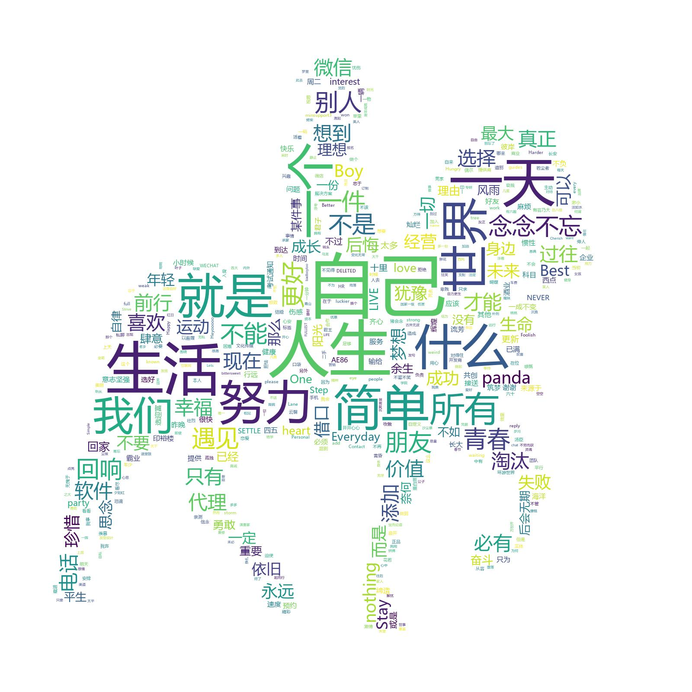

### 此项目只是简单地将[webWeixin][1]和[挖数提供的词云案例][2]整合到一起

运行过程：
```
cmd输入：python webWeixin.py
扫码登录
代码会默认根据微信好友的签名自动会生成一个output.txt文件，然后根据txt文件生成词云

可以自定义数据来源：
1.好友：包括昵称、备注、签名、性别（代码只将签名写入了txt文件，如果需要其他数据，可修改webWeixin.py 333行处代码）
2.公众号
3.群聊
4.全部
```

```
条件：
python3
jieba、wordcloud、request等模块
```
将本项目克隆到本地即可运行。

效果：



最关键的词语是：人生、自己、生活，大部分朋友的签名都是关乎自己的生活，努力活着:)


  [1]: https://github.com/CriseLYJ/awesome-python-login-model/blob/master/webWeixin/webWeixin.py
  [2]: https://www.zhihu.com/question/28975391/answer/100796070
